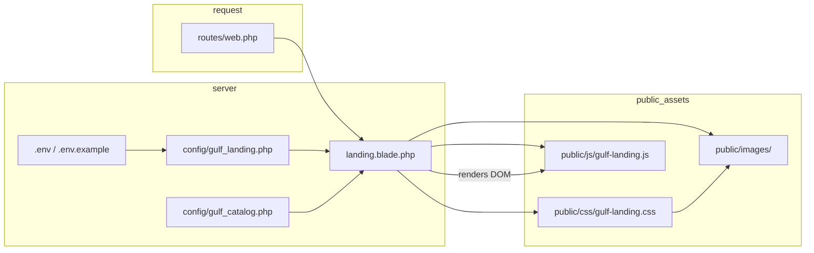

# Laravel project — framework layout, Gulf landing, and related changes

This document describes **where the framework lives**, **where Gulf landing work is done**, and **how those pieces depend on each other**. For image paths and the static Figma prototype folder, see `STATIC_WEBSITE_STRUCTURE.md`.

---

## Framework

| Item | Value |
|------|--------|
| Framework | **Laravel 5.4** (`laravel/framework`: `5.4.*`) |
| PHP (per `composer.json` scripts) | PHP 5.6+ |
| Web entry | `public/index.php` (document root for Apache/IIS) |
| Autoload (app code) | PSR-4: `App\` → `app/` |

---

## Standard Laravel directories (what they are for)

| Directory | Role |
|-----------|------|
| `app/` | Application code: `Http/` (controllers, middleware, `Kernel`), `Providers`, `Console`, models like `User.php`. This project serves the home page **without** a dedicated controller (closure in `routes/web.php`). |
| `bootstrap/` | Framework bootstrap; `cache/` holds generated config/route caches. |
| `config/` | PHP config arrays. Laravel auto-loads `config/*.php` as `config('filename.key')`. **Gulf adds** `gulf_landing.php` and `gulf_catalog.php`. |
| `database/` | Migrations, factories, seeds (unused for the static landing if no DB features). |
| `public/` | **Only** folder that should be exposed to the web. CSS, JS, images for the landing live here. |
| `resources/views/` | Blade templates. **`landing.blade.php`** is the main page. |
| `routes/web.php` | HTTP routes. **`/`** returns `view('landing')`. |
| `storage/` | Logs, compiled views (`framework/views/`), sessions, cache. **Generated at runtime** — do not treat as source-of-truth for edits. |
| `tests/` | PHPUnit tests. |
| `vendor/` | Composer dependencies. **Do not edit**; regenerate via `composer install`. |

---

## Gulf-specific: where you create or edit files

### 1. Route → view

| File | Change when |
|------|-------------|
| `routes/web.php` | You change the URL for the landing page or point `/` at another view. |

Current behavior: `Route::get('/', function () { return view('landing'); });`

### 2. Blade (markup + server-side catalog data)

| File | Change when |
|------|-------------|
| `resources/views/landing.blade.php` | Page structure, copy, `asset()` / `url()` links, catalog section markup, `@php` block that reads config and builds filter lists. |

**Config usage in this view:**

- `config('gulf_landing.pharmacist_chat_url')` — “Chat with a Pharmacist” link (from `.env` via `GULF_PHARMACIST_CHAT_URL`).
- `config('gulf_catalog.landing_products', config('gulf_catalog.products', []))` — product rows for the catalog grid and derived brand/category filter checkboxes.

### 3. Config (data and helpers)

| File | Change when |
|------|-------------|
| `config/gulf_landing.php` | Default or structure for landing-only settings (e.g. pharmacist chat URL key). |
| `config/gulf_catalog.php` | Product feeds (`$simpleRows`, `$medicalRows`), normalization to `landing_products`, helper functions (`gulf_catalog_brand_slug`, pricing text, etc.). |

**Related change rule:** If you add a **new brand slug** or **category slug** in `gulf_catalog.php`, update the label maps in `landing.blade.php` (`$catalogBrandLabels`, `$catalogCategoryLabels`) and any `?cats=` query links so filters and deep links stay consistent.

### 4. Front-end assets

| File | Change when |
|------|-------------|
| `public/css/gulf-landing.css` | Layout, typography, catalog/filters/modal/cart styling. Image URLs in CSS use paths **relative to the CSS file** (e.g. `../images/...`). |
| `public/js/gulf-landing.js` | Catalog filtering, search, sort, modal, cart count, URL query `cats` + hash `#catalog` behavior. |

**Related change rule:** Filter checkboxes use `data-filter-group="brand|category"` and `value="<slug>"`. Those values must match slugs emitted from Blade/config. JS does not read `gulf_catalog.php` directly — it only manipulates the DOM the Blade template renders.

### 5. Environment template

| File | Change when |
|------|-------------|
| `.env.example` | You add a new `env()`-backed setting that teammates must set locally (e.g. `GULF_PHARMACIST_CHAT_URL`). |
| `.env` (local, not always in git) | Actual values for your machine; copy from `.env.example` and adjust. |

### 6. Static prototype (optional, parallel to Laravel)

| Path | Role |
|------|------|
| `gulf-figma-static/` | Plain HTML/CSS/JS mirror for design iteration. Not loaded by Laravel. |

Keep prototype and Laravel in sync manually when changing layout or behavior (see workflow in `STATIC_WEBSITE_STRUCTURE.md`).

### 7. Images

| Path | Role |
|------|------|
| `public/images/` | All raster/SVG assets referenced by `landing.blade.php` and `gulf-landing.css`. |

**Gulf-specific files (names only):**

- `routes/web.php`
- `resources/views/landing.blade.php`
- `config/gulf_landing.php`
- `config/gulf_catalog.php`
- `public/css/gulf-landing.css`
- `public/js/gulf-landing.js`
- `.env.example`
- `.env`
- `gulf-figma-static/index.html`
- `gulf-figma-static/assets/css/style.css`
- `gulf-figma-static/assets/js/script.js`
- `public/images/` (folder)

---

## Dependency diagram (simplified)

---

## Typical “related changes” checklist

| You change… | Also check… |
|-------------|-------------|
| Product list or slugs in `gulf_catalog.php` | `landing.blade.php` brand/category labels; category links in hero/cards (`cats` query); `gulf-landing.js` if you change `data-*` or IDs. |
| New section in HTML | `gulf-landing.css` for styles; `gulf-landing.js` if it needs behavior; images under `public/images/`. |
| Pharmacist chat URL | `.env` / `.env.example` and `config/gulf_landing.php`. |
| Catalog filter behavior | `gulf-landing.js` + matching checkbox markup in `landing.blade.php`. |
| Static prototype | Same conceptual changes in `resources/views/landing.blade.php` and `public/css/gulf-landing.css` when you promote to Laravel. |

---

## Git / workspace notes (as of last snapshot)

Tracked modifications often cluster around:

- `.env.example` — e.g. Gulf env vars.
- `public/css/gulf-landing.css`, `public/js/gulf-landing.js`, `resources/views/landing.blade.php` — landing UI and catalog.
- New config files: `config/gulf_catalog.php`, `config/gulf_landing.php`.

**Untracked / duplicate files** (if present): files named like `gulf-landing copy.css` or `landing.blade copy.php` are usually backups; they are **not** loaded by Laravel. Prefer a single canonical path for each asset.

**Do not commit** secrets from `.env`; keep examples only in `.env.example`.

---

## Quick reference: “where do I put it?”

| Need | Location |
|------|----------|
| New URL or controller | `routes/web.php`, optionally `app/Http/Controllers/` |
| HTML for `/` | `resources/views/landing.blade.php` |
| Global PHP settings | `config/*.php` |
| Product/catalog data | `config/gulf_catalog.php` |
| Chat link setting | `config/gulf_landing.php` + `GULF_PHARMACIST_CHAT_URL` in `.env` |
| Styles | `public/css/gulf-landing.css` |
| Scripts | `public/js/gulf-landing.js` |
| Images | `public/images/` |
| Figma/static-only draft | `gulf-figma-static/` |

---

## See also

- `STATIC_WEBSITE_STRUCTURE.md` — image inventory, static vs Laravel paths, sync workflow.
- `composer.json` — Laravel version and PHP constraints.
